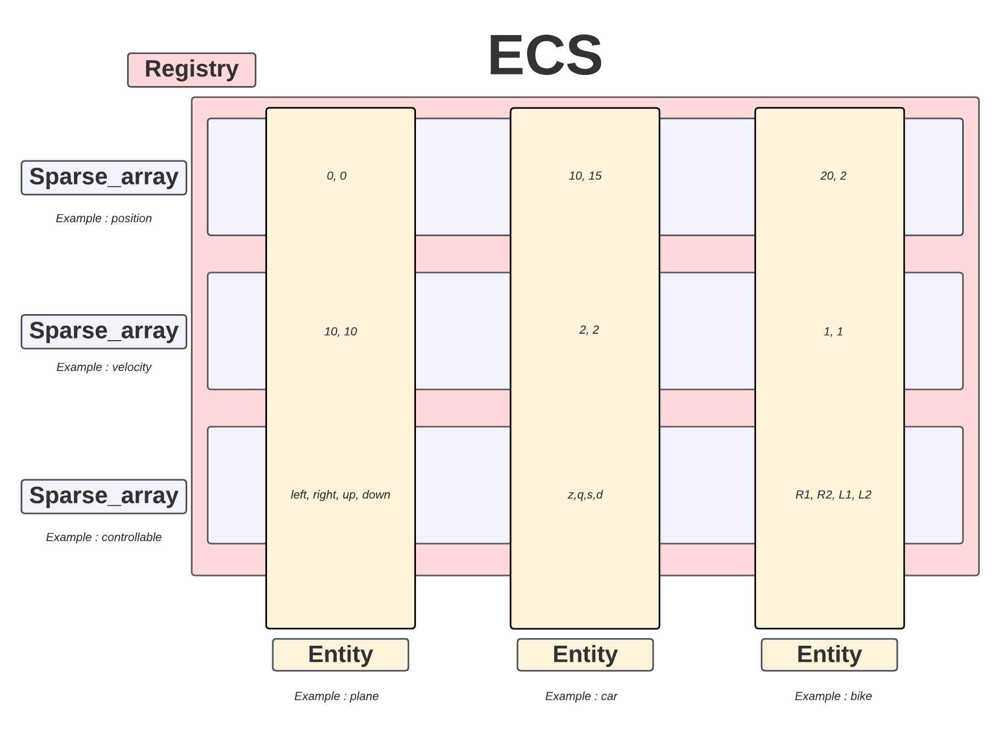

# ECS

## Description

This project is an ECS(Entity component system) realized in c++.



## Build


Our R-Type game is implemented with this ecs, you can view it here : https://github.com/EpitechPromo2025/B-CPP-500-PAR-5-2-rtype-alexandre.chetrit


### Build for Linux and MacOs

To build :


```bash
./build_unix.sh
```

To clean and rebuild from scratch :

```bash
./build_unix.sh re
```

Tu clean the repo :

```bash
./build_unix.sh clean
```

### Build for Windows


To build :

```bash
./build_windows.bat
```

To clean and rebuild from scratch :

```bash
./build_windows.bat re
```

To clean the repo :

```bash
./build_windows.bat clean
```

## Usage

To start you have to create a registry :


```bash
ecs::registry_t r;
```

and then add all components that you will used in your registry (here an example with velocity component):

```bash
r.register_components<ecs::pos_t, ecs::velocity_t>();
```

Her, you can create an entity and add a component (ex: velocity_t) to this entity:

```bash
ecs::entity_t entity = r.spawn_entity();
r.emplace_component<ecs::velocity_t>(entity, 2, 2);
```

You can get an array of component like this in given wanted component:

```bash
auto &velocities = r.get_components<ecs::velocity_t>();
```
## Documentation

You can find all the documentation in the file "doc" :

```bash
cd doc
```

See [ECS-scheme.png](doc/ECS-scheme.png) for the shema of the ecs

## Features

See [CHANGELOG.md](./CHANGELOG.md) for a complete details of features and versions.

## Authors

- [Alexandre Chetrit](https://github.com/chetrit)
- [Théo de Boysson](https://github.com/BoyssonFresh)
- [Julien Letoux](https://github.com/lockhead)
- [Ines Maaroufi](https://github.com/Happinesseuh)